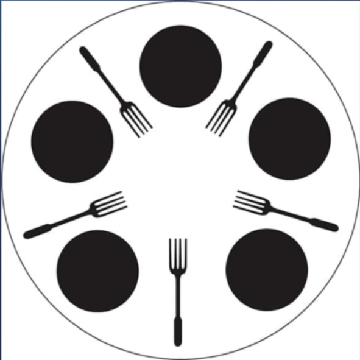

## The Dining Philosophers 
* A classic CS problem introduced by Dijkstra in 1965
* Five philosophers live in a house together, and they always dine together at the same table, sitting on the same place.
* They always eat a special kind of spaghetti which requires 2 forks.
* There are two forks next to each plate, which means that no two neighbours can be eating at the same time.

